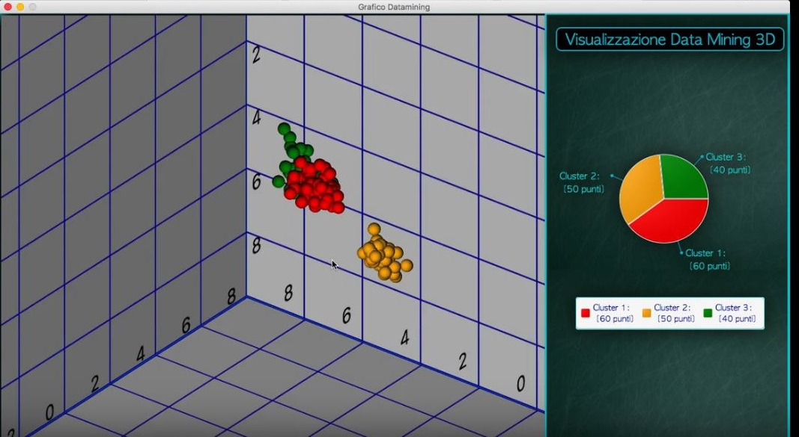
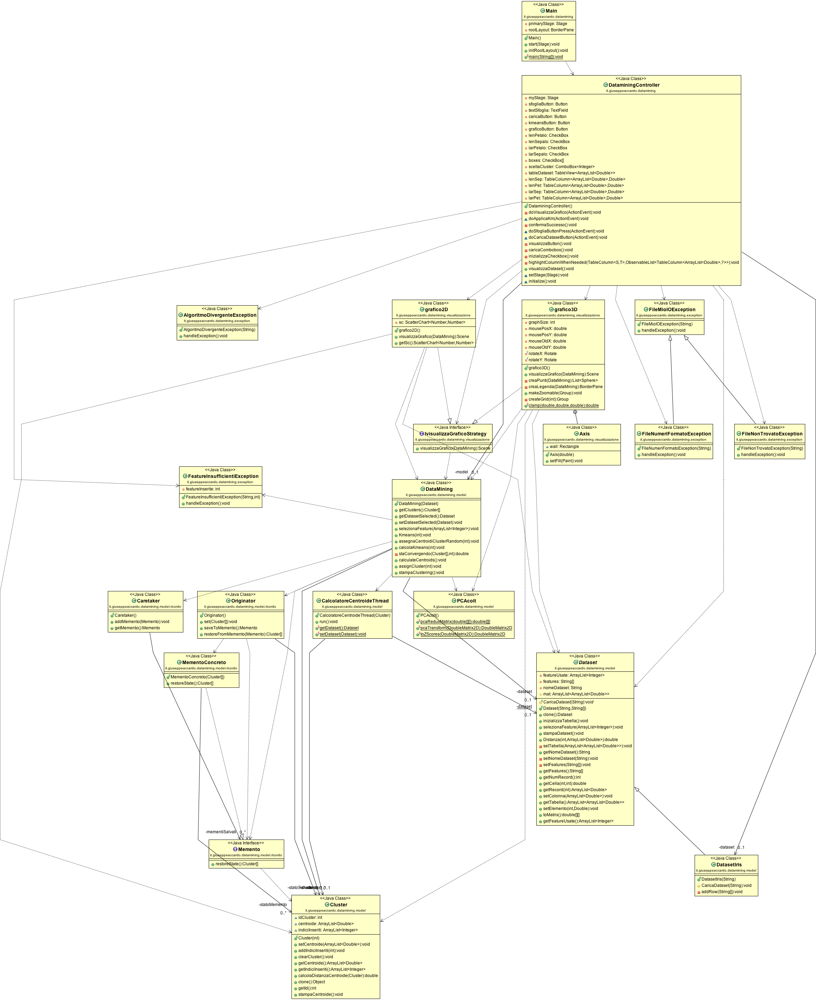

# Data-Mining-Iris
Using Data Mining techniques, an application has been created that recognizes, starting from the Data Iris, the types of flowers and estimates of the statistics.
The project, in addition to algorithms related to **Machine Learning** (K-Means, PCA, etc.), involves the use of software engineering concepts such as the **Design Pattern** and the **SOLID** principles.

The main phases of the project include: selection of characteristics, clustering and 2D / 3D visualization. If more than 3 characteristics are used, transformation techniques are used to reduce the characteristics, such as the PCA.

The technology used is **JAVA** for **OOP** modeling and application of **software engineering** concepts, while for the GUI the **JavaFX** framework was used, creating menus, 2D graphs and 3D representations.

